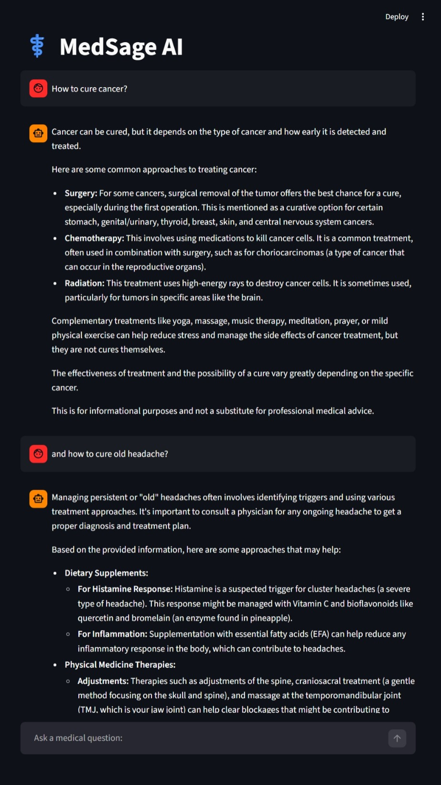
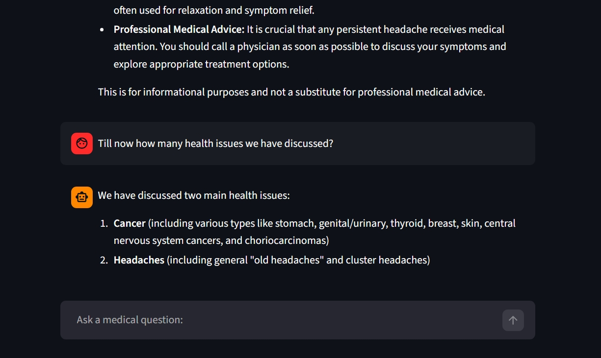

# MedSage AI

A medical question-answering system powered by Retrieval-Augmented Generation (RAG). MedSage AI uses vector embeddings and a large language model to answer medical queries based on the Gale Encyclopedia of Medicine.

**Live Demo:** [medisage-ai.streamlit.app](https://medisage-ai.streamlit.app/)

## Application Preview

| Full Chat Interface | Conversational Memory |
| :---: | :---: |
|  |  |

> **Note:** The second image demonstrates the system's ability to recall previous context.

## Features

- **RAG-based QA**: Combines retrieval from a medical knowledge base with generative AI
- **Chat history awareness**: Remembers conversation context for follow-up questions
- **Medical-grade responses**: Provides professionally sound information with layman-friendly explanations
- **Disclaimer included**: Always includes a medical disclaimer with each response
- **Streamlit UI**: Clean web interface for interacting with the system


## Tech Stack

- **Frontend**: Streamlit
- **LLM**: Google Gemini 2.5 Flash
- **Embeddings**: sentence-transformers/all-MiniLM-L6-v2
- **Vector Store**: FAISS
- **Framework**: LangChain (1.2.14)
- **Data Source**: Gale Encyclopedia of Medicine (PDF)

## Project Structure

```
MediSage AI/
├── app.py                      # Streamlit web application
├── src/
│   ├── engine.py               # RAG chain implementation
│   └── 01_create_memory.ipynb  # Notebook for creating vector store
├── data/
│   └── The_GALE_ENCYCLOPEDIA_of_MEDICINE_SECOND.pdf
├── vectorstore/db_faiss/       # FAISS vector database
├── requirements.txt            # Python dependencies
└── pyproject.toml              # Project metadata
```

## Setup

1. **Clone the repository**
2. **Create a virtual environment**
   ```bash
   python -m venv .venv
   .venv\Scripts\activate  # Windows
   # or source .venv/bin/activate  # Linux/Mac
   ```
3. **Install dependencies**
   ```bash
   pip install -r requirements.txt
   ```
4. **Set up environment variables**
   
   Create a `.env` file in the project root:
   ```
   GOOGLE_API_KEY=your_api_key_here
   ```
   
   Get your API key from [Google AI Studio](https://aistudio.google.com/app/apikey)

5. **Create the vector store** (if not already created)
   
   Run the notebook `src/01_create_memory.ipynb` to process the PDF and create FAISS index

## Usage

Start the Streamlit app:
```bash
streamlit run app.py
```

The application will open in your browser at `http://localhost:8501`. Ask medical questions and receive AI-powered answers based on the encyclopedia content.

## Architecture

1. **Document Processing**: PDF loaded and split into chunks using PyPDF
2. **Embedding**: Text chunks embedded using HuggingFace sentence-transformers
3. **Vector Storage**: Embeddings stored in FAISS for fast similarity search
4. **Retrieval**: History-aware retriever reformulates queries using chat context
5. **Generation**: Gemini model generates answers from retrieved context

## Disclaimer

This application is for informational purposes only. The responses include a disclaimer that this is not a substitute for professional medical advice. Always consult a qualified healthcare provider for medical concerns.
